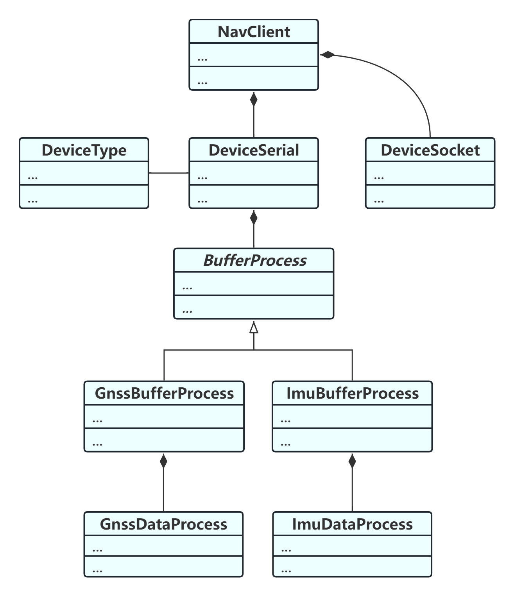

# NavClient
### 1.简介
发送gnss数据与imu数据的客户端程序，数据发送给远程服务端保存，客户端应用于ubuntu系统的Orangepi开发板，连接惯导与卫星导航两个模块采集数据。

### 2.UML类图



### 3.项目依赖

#### 3.1serial依赖
Required:
* **catkin**- cmake and Python based buildsystem
* **cmake**- buildsystem
* **Python** - scripting language
  * **empy**- Python templating library
  * **catkin_pkg** - Runtime Python library for catkin
#### 3.2navClient依赖
Required:
* **make**
* **g++**
### 4.Install
#### 4.1 Serial install
```shell
cd serial/

make

make install

sudo mv /tmp/usr/local/include/* /usr/local/include/

sudo mv /tmp/usr/local/lib/libserial.so /usr/local/lib/libserial.so
```
#### 4.2 navClient install
```shell
cd NavClient/

make

./navClient
```
